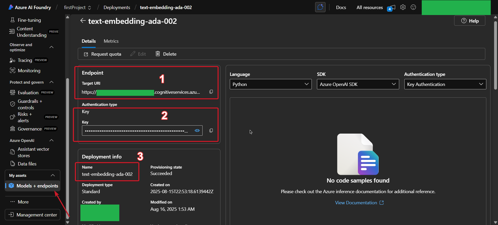

# Embedding Search Demo

This repository demonstrates semantic search capabilities using Azure OpenAI Services and PostgreSQL with vector extensions. The application allows you to search for products using natural language queries by leveraging embedding vectors for similarity matching.

## How It Works

When a user submits a search query, the application first sends the text to the Azure OpenAI embeddings model to convert it into a vector. This vector is then used to query the PostgreSQL database, which uses the pgvector extension to find the most similar product vectors and returns the corresponding products.

## Prerequisites

- .NET 9.0 SDK
- Docker (for PostgreSQL with vector extensions) / PostgreSQL Db
- Azure OpenAI Service account

## Database Setup

**Important**: This project requires PostgreSQL with vector extension support. Use the following Docker image which includes pgvector:

```bash
docker run --name postgres-vector \
  -e POSTGRES_PASSWORD=your-password \
  -e POSTGRES_USER=postgres \
  -e POSTGRES_DB=EmbeddingSearch \
  -p 5432:5432 \
  -d pgvector/pgvector:pg17
```

The `pgvector/pgvector:pg17` image includes PostgreSQL 17 with the pgvector extension pre-installed, which is essential for storing and querying vector embeddings.

## Azure OpenAI Configuration

To configure Azure OpenAI services, you'll need to update the `appsettings.json` file with your Azure OpenAI resource details.



In the Azure OpenAI dashboard shown above:
- **1** corresponds to the **Endpoint** in `appsettings.json` 
  > ⚠️ **Important**: Copy only the base URL up to `.openai.azure.com/` (do not include the full path with `/openai/deployments/...`)
- **2** corresponds to the **Key** in `appsettings.json`  
- **3** corresponds to the **DeploymentName** in `appsettings.json`

Update your `appsettings.json` with these values:

```json
{
  "AzureOpenAI": {
    "Embeddings": {
      "Endpoint": "https://your-azure-openai-endpoint/", // base URL of your Azure OpenAI resource
      "Key": "your-azure-openai-key", // the api key associated with your Azure OpenAI resource
      "DeploymentName": "your-deployment-name" // e.g., "text-embedding-ada-002"
    }
  }
}
```

## Getting Started

1. **Clone the repository**
   ```bash
   git clone https://github.com/matic113/embedding-search.git
   cd embedding-search
   ```

2. **Start PostgreSQL with vector support**
   ```bash
   docker run --name postgres-vector \
     -e POSTGRES_PASSWORD=your-password \
     -e POSTGRES_USER=postgres \
     -e POSTGRES_DB=EmbeddingSearch \
     -p 5432:5432 \
     -d pgvector/pgvector:pg17
   ```

3. **Configure Azure OpenAI**
   - Update `appsettings.json` with your Azure OpenAI credentials (see configuration section above)

4. **Run database migrations**
   ```bash
   cd EmbeddingSearch
   dotnet ef database update
   ```

5. **Start the application**
   ```bash
   dotnet run
   ```

6. **Access the API**
   - Open your browser to `https://localhost:5001/scalar` (or the port shown in console)
   - Use the API endpoints to create products and perform semantic searches